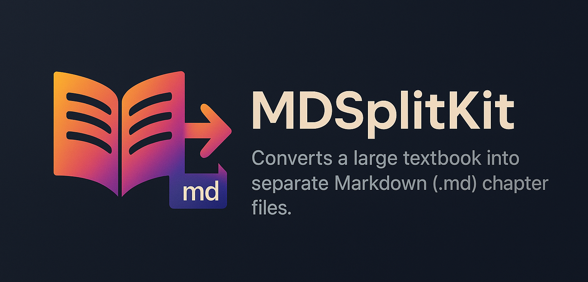

# ✂️ MDSplitKit: Effortless Markdown Chapter Splitting

[](https://opensource.org/licenses/MIT)
<!-- Add other badges like Python version, build status, etc. -->
<!-- e.g., [](https://www.python.org/) -->



**Tame your large Markdown files! MDSplitKit provides a simple local web interface to incrementally split documents into chapters based on line numbers.**

---

## ✨ Features

*   **⬆️ Upload & View:** Easily upload large Markdown files.
*   **📄 Line-Numbered Display:** View your content with clear line numbers.
*   **🖱️ Interactive Splitting:** Select the *start* of the next chapter by:
    *   Clicking a line number in the code viewer.
    *   Clicking a detected title in the sidebar list.
*   **✂️ Incremental Extraction:** Extract content *before* your selected line into a new chapter file.
*   **💾 Auto-Save Progress:** **Crucially, MDSplitKit overwrites the original uploaded file** with the *remaining* content after each split, saving your progress incrementally. No more manual copy-pasting!
*   **📊 Progress Tracking:** A visual progress bar shows how much of the original file you've processed.
*   **📂 Output Management:** See a list of extracted chapter filenames directly in the interface. Chapters are saved to `static/output/`.


*Fig 1: Screenshot of the MDSplitKit interface showing loaded content and extracted chapters.*

## 🤔 Why MDSplitKit?

Working with massive Markdown documents (like textbooks, manuscripts, or extensive notes) can be cumbersome. MDSplitKit streamlines the process of breaking these down into manageable chapters or sections without needing complex scripts or manual file juggling. The incremental overwrite feature ensures you can pick up where you left off.

## 🛠️ Tech Stack

*   **Backend:** Python, Flask
*   **Frontend:** HTML, CSS, Vanilla JavaScript
*   **Markdown Parsing:** Python `markdown` library, `PyYAML` (for potential front matter)

## 📁 Project Structure

```
mdsplitkit/
├── app.py             # Main Flask application logic
├── requirements.txt   # Python dependencies
├── run.sh             # Script to setup environment and run the app
├── sample_textbook.md # Example large markdown file
├── static/            # Frontend assets (CSS, JS, Output Chapters)
│   ├── css/
│   ├── js/
│   └── output/        # Default location for extracted chapters
├── templates/
│   └── index.html     # Main HTML template
├── utils/
│   └── markdown_parser.py # Logic for parsing and splitting
├── docs/
│   └── images/        # Banner and demo images
├── .venv/             # Virtual environment (if created using script)
└── README.md          # This file
```

## 🚀 Getting Started

### Prerequisites

*   **Python 3:** Make sure you have Python 3 installed. You can check by running `python3 --version` in your terminal.

### Installation

1.  **Clone the Repository:**
    ```bash
    git clone <your-repo-url> # Or download the ZIP
    cd mdsplitkit
    ```
2.  **Create & Activate Virtual Environment:** (Recommended to keep dependencies tidy!)
    ```bash
    # Create the environment
    python3 -m venv .venv

    # Activate it (command depends on your shell)
    # macOS / Linux (Bash/Zsh):
    source .venv/bin/activate
    # macOS / Linux (Fish):
    source .venv/bin/activate.fish
    # Windows (Command Prompt):
    # .venv\Scripts\activate.bat
    # Windows (PowerShell):
    # .venv\Scripts\Activate.ps1
    ```
    *(You should see `(.venv)` at the start of your terminal prompt)*
3.  **Install Dependencies:**
    ```bash
    python3 -m pip install -r requirements.txt
    ```

## ⚙️ Usage

1.  **Activate Environment:** If not already active, activate your virtual environment:
    ```bash
    source .venv/bin/activate # Or your shell's equivalent
    ```
2.  **Launch the App:** Start the Flask development server:
    ```bash
    python3 app.py
    ```
3.  **Open in Browser:** Navigate to [http://127.0.0.1:5001/](http://127.0.0.1:5001/)

### Workflow

1.  **Load:** Click "Load Markdown File" and select your `.md` file.
2.  **Select Split Point:** Browse the content viewer. Click the line number (or title in the sidebar) where the *next* chapter begins.
3.  **Extract:** Click "Extract Chapter". Confirm or edit the filename in the pop-up. **Read the warning about overwriting the original!** Click "Confirm & Extract".
4.  **Repeat:** The app saves the chapter, **overwrites the uploaded file with the remainder**, and refreshes. Repeat steps 2-3.
5.  **Stop:** Press `Ctrl+C` in the terminal where `app.py` is running.
6.  **(Optional) Deactivate:** Type `deactivate` in the terminal.

## 🤝 Contributing

Contributions are welcome! Please feel free to submit issues or pull requests.

1.  Fork the Project
2.  Create your Feature Branch (`git checkout -b feature/AmazingFeature`)
3.  Commit your Changes (`git commit -m 'Add some AmazingFeature'`)
4.  Push to the Branch (`git push origin feature/AmazingFeature`)
5.  Open a Pull Request

## 📜 License

Distributed under the MIT License. See `LICENSE` file for more information (if one exists, otherwise state MIT).
